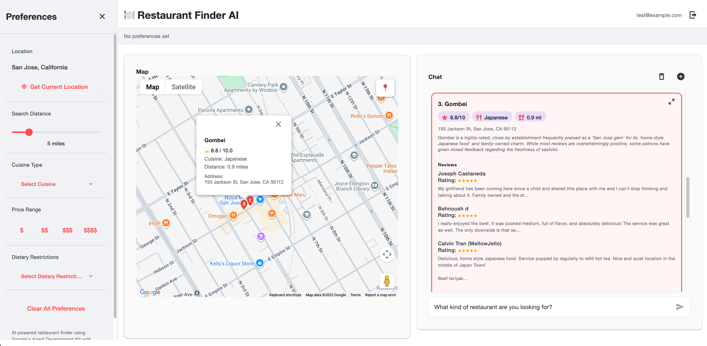
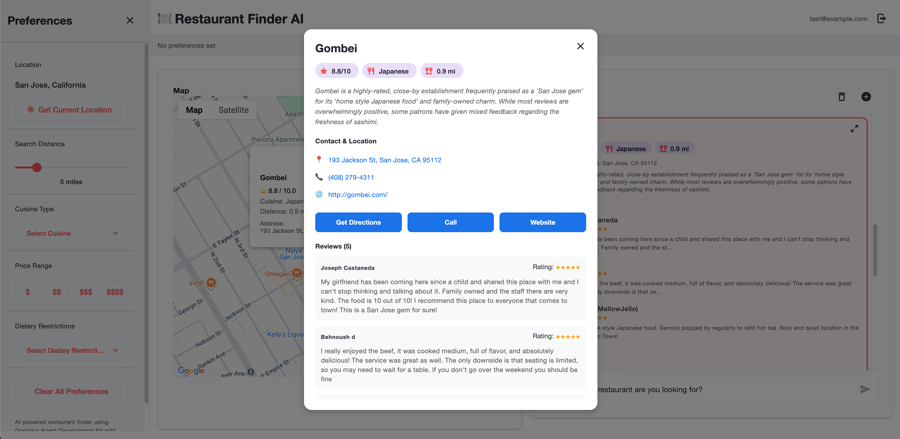

# Restaurant Finder Agent

An AI-powered restaurant recommendation system built with Google Vertex AI Agent SDK. The application uses a multi-agent architecture to search, filter, and recommend restaurants based on user preferences.





## Architecture

```
┌─────────────────────────────────────────────────────────────────┐
│                        Frontend Options                          │
│  ┌──────────────────┐    ┌─────────────────────────────────┐    │
│  │   Streamlit UI   │    │   React Native Web App          │    │
│  │  (Development)   │    │   (Production)                  │    │
│  └────────┬─────────┘    └───────────────┬─────────────────┘    │
└───────────┼──────────────────────────────┼──────────────────────┘
            │                              │
            ▼                              ▼
┌───────────────────────┐    ┌─────────────────────────────────┐
│  Vertex AI Agent      │◄───│   Flask Backend API             │
│  Engine (Cloud)       │    │   (REST Bridge)                 │
└───────────┬───────────┘    └─────────────────────────────────┘
            │
            ▼
┌─────────────────────────────────────────────────────────────────┐
│              Multi-Agent Orchestration                           │
│  ┌────────────┐   ┌────────────┐   ┌─────────────────────┐     │
│  │  Search    │──▶│  Filter    │──▶│  Recommendation     │     │
│  │  Agent     │   │  Agent     │   │  Agent              │     │
│  └────────────┘   └────────────┘   └─────────────────────┘     │
└───────────────────────────┬─────────────────────────────────────┘
                            │
                            ▼
┌─────────────────────────────────────────────────────────────────┐
│                    External APIs (via MCP)                       │
│  ┌─────────────────────┐    ┌─────────────────────────────┐    │
│  │  Google Places API  │    │  Apple Maps API             │    │
│  └─────────────────────┘    └─────────────────────────────┘    │
└─────────────────────────────────────────────────────────────────┘
```

## Project Structure

```
restaurant_finder_agent/
├── restaurant_finder/           # Python backend
│   ├── agents/                  # Multi-agent system
│   │   ├── main_restaurant_agent.py
│   │   └── sub_agents/
│   │       ├── search_agent.py
│   │       ├── filter_agent.py
│   │       └── recommendation_agent.py
│   ├── google_tools/            # Google Places MCP integration
│   ├── apple_tools/             # Apple Maps MCP integration
│   ├── agent.py                 # Main entry point
│   ├── streamlit.py             # Local development UI
│   └── deploy_to_vertex.py      # Cloud deployment
│
└── restaurant-finder-react-app/ # React Native frontend
    ├── src/
    │   ├── components/
    │   └── pages/
    ├── backend/                 # Flask API server
    └── App.js
```

## Prerequisites

- Python 3.9+
- Node.js 18+
- Google Cloud Platform account with Vertex AI enabled
- Google Places API key

## Setup

### 1. Clone and Install Dependencies

```bash
# Backend
cd restaurant_finder
python -m venv venv
source venv/bin/activate  # On Windows: venv\Scripts\activate
pip install -r requirements.txt

# Frontend (optional)
cd ../restaurant-finder-react-app
npm install
```

### 2. Configure Environment

Copy the example environment file and fill in your credentials:

```bash
cd restaurant_finder
cp .env.example .env
```

Required environment variables:

| Variable | Description |
|----------|-------------|
| `GOOGLE_CLOUD_PROJECT` | Your GCP project ID |
| `GOOGLE_CLOUD_LOCATION` | GCP region (e.g., `us-west1`) |
| `GOOGLE_GENAI_USE_VERTEXAI` | Set to `1` |
| `GOOGLE_PLACES_API_KEY` | Google Places API key |

### 3. Authenticate with Google Cloud

```bash
gcloud auth application-default login
gcloud config set project YOUR_PROJECT_ID
```

## Running the Application

### Option 1: Streamlit UI (Development)

```bash
cd restaurant_finder
streamlit run streamlit.py
```

### Option 2: React Web App (Full Stack)

```bash
# Terminal 1: Start Flask backend
cd restaurant-finder-react-app/backend
python server.py

# Terminal 2: Start React frontend
cd restaurant-finder-react-app
npm run web
```

- Backend runs on: `http://localhost:5000`
- Frontend runs on: `http://localhost:8081`

### Option 3: Deploy to Vertex AI

```bash
cd restaurant_finder
python deploy_to_vertex.py
```

## Technology Stack

### Backend
- **Google Vertex AI Agent SDK** - Multi-agent orchestration
- **MCP (Model Context Protocol)** - Tool integration
- **Streamlit** - Development UI
- **Flask** - REST API bridge

### Frontend
- **React Native Web** - Cross-platform UI
- **Expo** - Development tooling
- **React Native Paper** - Material Design components
- **Google Maps JavaScript API** - Map display

### Infrastructure
- **Google Cloud Platform** - Vertex AI, Secret Manager, Cloud Run
- **Docker** - Containerization for MCP microservices

## API Endpoints

### Flask Backend

| Endpoint | Method | Description |
|----------|--------|-------------|
| `/api/health` | POST | Health check |
| `/api/search` | POST | Search restaurants |

### Search Request Example

```json
{
  "query": "Italian restaurant with outdoor seating",
  "location": {
    "lat": 37.7749,
    "lng": -122.4194
  },
  "preferences": {
    "cuisine": "Italian",
    "price_level": "$$",
    "dietary_restrictions": ["vegetarian"]
  }
}
```

## Agent Workflow

1. **Search Agent**: Queries Google Places/Apple Maps APIs for restaurants matching criteria
2. **Filter Agent**: Ranks and filters results based on user preferences, fetches detailed information
3. **Recommendation Agent**: Formats results into user-friendly recommendations with reasoning

## License

MIT
